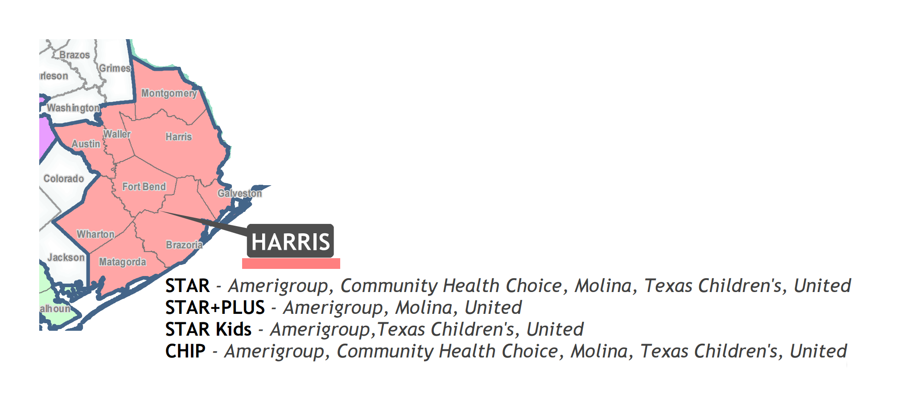

# Refugee Case Management Bulletin Board

- These are resources for Social Adjustment Services.
- The links point to documents or websites. 
- Sharing & Editing is encouraged! (Here's [instructions](#instructions-for-editing)).

### Frequently Referenced Sections
- [Gold Card](#gold-card)
- [Medical Transportation](#medically-necessary-transportation)
- [Rental Assistance](#rental-assistance)

# Health

## Primary Care Providers
- [PCP Map around YMCA International](https://drive.google.com/open?id=1kk9yn6-4nifHLIf2tGYbW_7PiYo&usp=sharing)
- Agenda for discussion
- Harris Health Locations
- Legacy Community Locations

## Healthcare Coverage
### [Medicaid](https://hhs.texas.gov/services/questions-about-your-benefits) is a [federal program](https://en.wikipedia.org/wiki/Medicaid) administered by Texas Health and Human Services.
- Traditional Medicaid & Children's Medicaid
	- [Texas Medicaid & Healthcare Partnership](http://www.tmhp.com/Pages/default.aspx)
- STAR (pregnant women, adults caring for children)
	- [Amerigroup](https://www.myamerigroup.com/TX/Pages/star.aspx), [Community Health Choice](https://www.communitycares.com/en-us/Plans-Benefits/Texas-STAR-Plan), [Molina](http://www.molinahealthcare.com/members/tx/en-US/hp/medicaid/star/Pages/star.aspx), [Texas Children's](http://www.texaschildrenshealthplan.org/what-we-offer/star), [UnitedHealthcare](http://www.uhccommunityplan.com/tx/medicaid/star/benefits.html)
- STAR+PLUS (disabled adults)
	- [Amerigroup](https://www.myamerigroup.com/TX/Pages/star-plus.aspx), [Molina](http://www.molinahealthcare.com/members/tx/en-US/hp/medicaid/starplus/Pages/starplus.aspx), [UnitedHealthcare](http://www.uhccommunityplan.com/tx/medicaid/star_plus.html)
- STAR Kids (disabled persons under 21 years old)
	- [Amerigroup](https://myamerigroup.com/TX/Pages/star-kids.aspx), [Texas Children's](http://www.texaschildrenshealthplan.org/what-we-offer/star-kids), [UnitedHealthcare](http://www.uhccommunityplan.com/tx/medicaid/star_kids.html)

### Refugee Medical Assistance (RMA)
- Texas Health and Human Services no longer administers RMA.
- USCRI contracted [Point Comfort Underwriters](https://rma.pointcomfort.com/#login) (PCU) as the new RMA vendor.
	- [RMA Handbook](https://rma.pointcomfort.com/files/RMA%20User%20Guide.pdf)
	- [Frequently Asked Questions](http://refugees.org/wp-content/uploads/2017/02/Texas-Refugee-Medical-Assistance-Frequently-Asked-Questions.pdf)
	- [Contact Sheet](materials/texas-rma-contacts.pdf)

### Gold Card
The [Harris Health Financial Assistance Program](https://www.harrishealth.org/en/patients/access-care/eligibility-card/pages/default.aspx)  (known colloquially as the "Gold Card") is a healthcare discount.
- Eligibility Office: 713 566 6509, dial 4 then 1 
- [Harris Health Contact Information](https://www.harrishealth.org/en/contact-us/pages/default.aspx)
- [Applications](https://www.harrishealth.org/SiteCollectionDocuments/eligibility/applicant-forms/English/application-instructions-english.pdf) are mailed to P.O. Box 300488 Houston TX 77230
- The applications *require* many supporting documents.
	- proof of identity
		- government issued photo ID
	- proof of gross income (last 30 days)
		- statement of support,
		- wage verification form, or
		- ALL paystubs dated within 30 days.
	- proof of residence
		- lease no older than 1 year or
		- residence verification form
	- proof of immigration status
		- *employment authorization document* or
		- *permanent resident card*
	- proof of familial relation (if applicable)
		- birth certificates for children
		- declaration of marriage
		- marriage license

### County Indigent Health Care
- The [income requirements](https://www.dshs.texas.gov/cihcp/eligibility.shtm) are steep.
- *Encourage your clients to live in Harris County.*

### Healthcare through the Affordable Care Act
- HealthCare.gov (from the [Affordable Care Act](https://www.healthcare.gov/glossary/affordable-care-act/))
	- be mindful of policy updates durring the passage of the [American Health Care Act](https://en.wikipedia.org/wiki/American_Health_Care_Act_of_2017#Comparison_between_ACA_and_AHCA)

## Vaccinations
- Clients within 1 year of arrival can make vaccination appointments at [Harris County Public Health](http://publichealth.harriscountytx.gov/Services-Programs/Programs/RefugeeScreening)
 	- Harwin Outreach Center
	- 7447 Harwin Drive, Suite 180 Houston, Texas 77036 
	- Phone: (713) 274-2599
	- Fax: (713) 437-4611
## Vision
- OneSight Program

## Dental 
- Low cost dental clinics

## Medical Bill Reconcilliation
- template for calling
- Charity Care Programs

## Refugee Health Profiles
### [CDC Refugee Health Profiles](https://www.cdc.gov/immigrantrefugeehealth/profiles/index.html)
- "key health and cultural information about specific refugee groups resettling in the United States"
### [NPCT Country Guides](https://gulfcoastjewishfamilyandcommunityservices.org/refugee/resources/country-condition-reports/)
- brief overviews of each country
	- current healthcare systems
	- common perceptions and responses to adverse mental health symptoms
	- typical community support networks
# Social Security
## Supplemental Security Income
- Contact: andy.hardwick@ssa.gov
- [form to designate a representative](https://www.ssa.gov/forms/ssa-1696.pdf)
	- part I, check Title XVI (SSI)
	- part II, check "I am a non-attorney not eligibile for direct payment", check no, check no
	- part III, check "I am waiving fees from any source"
# Transportation

## Medically Necessary Transportation
### MTM
- Non Emergency Medical Transportation for *recipients of Medicaid*
	- a healthcare provider *must* to complete a [statement of medical need](materials/statement-of-medical-need.pdf)
	- You can use a [table in English](materials/calling-a-taxi-cheat-sheet.xlsx) or [Spanish](https://github.com/ColtonGrainger/ymca-resources/blob/master/materials/calling-a-taxi-cheat-sheet-spanish.xlsx) for the phone call.
	- Phone: 855 687 4786

### METROLift
- [Eligibility](http://www.ridemetro.org/Pages/MLEligibility.aspx)
- [Application](https://www.ridemetro.org/MetroPDFs/News/Application-for-METROLift-Service.pdf)

## Metropolitian Transportation
### METRO Bus Education
- [METRO 101: How to Ride the Bus](https://www.youtube.com/watch?v=X0hQ3X8cfFs)

- How to use the fare card
	- **Tap It**: Tap your card on the Q Box to pay for your trip. The screen will show your new balance and how many rides you've taken.
	- **No Passback**: If you tap your card twice a red light turns on. The screen will read NO PASS BACK. The red light indicates you've already paid for the trip. You will not be charged again if you tap twice.
	- **Transfers**: Transfers are free and will be recorded automatically on your card. *They are valid for up to three hours.*
- Route planning (pro tip: use Google Maps)
	- Where do I want to go?
	- Which route(s) should I take?
	- How much does it cost to ride? 
	- Where should I board the bus?
	- How early should I arrive at my stop?
	- When will I reach my destination?

### [Discounted Q-Cards](http://www.ridemetro.org/Pages/FareDiscountedFare.aspx)
- [Students](http://www.ridemetro.org/Pages/FareStudent.aspx) pay %50
- Seniors 65-69 and Medicare cardholders pay %50

### Transit Maps
- [Houston METRO Map](https://www.ridemetro.org/MetroPDFs/NBN/New-METRO-System-Map.pdf)
- How to Google Maps with foreign languages.
	- An example route in [English](https://www.google.com/maps/dir/YMCA+International+Services+%D8%A7%D9%84%D9%85%D9%86%D8%B8%D9%85%D9%87,+6300+Westpark+Dr+%23600,+Houston,+TX+77057%E2%80%AD/Houston+Social+Security+Office,+10703+Stancliff+Rd,+Houston,+TX+77099/@29.7029048,-95.5670929,13z/data=!4m13!4m12!1m5!1m1!1s0x8640c3ca88e98717:0x9f59b67ffa8ce40b!2m2!1d-95.4956358!2d29.7237297!1m5!1m1!1s0x8640e7e4f226fcd9:0x90ae5ae08d489800!2m2!1d-95.5686086!2d29.6583674?hl=en) (add the text *?hl=en* to the end of the URL).
	- An example route in [Farsi](https://www.google.com/maps/dir/YMCA+International+Services+%D8%A7%D9%84%D9%85%D9%86%D8%B8%D9%85%D9%87,+6300+Westpark+Dr+%23600,+Houston,+TX+77057%E2%80%AD%E2%80%AD/Houston+Social+Security+Office,+10703+Stancliff+Rd,+Houston,+TX+77099/@29.7029048,-95.5670929,13z/data=!4m13!4m12!1m5!1m1!1s0x8640c3ca88e98717:0x9f59b67ffa8ce40b!2m2!1d-95.4956358!2d29.7237297!1m5!1m1!1s0x8640e7e4f226fcd9:0x90ae5ae08d489800!2m2!1d-95.5686086!2d29.6583674?hl=fa) (add the text *?hl=fa* at the end of the URL). 
	- Here's a [list of language codes](https://sites.google.com/site/tomihasa/google-language-codes) to translate Google maps.
		- *?hl=ar* for Arabic
		- *?hl=fr* for French
		- *?hl=ps* for Pashto
		- *?hl=ur* for Urdu
		- *?hl=km* for Cambodian
		- *?hl=sw* for Swahili
		- *?hl=es* for Spanish
		- *?hl=bn* for Bengali
		
# Housing
## Rental Assistance
- [Emergency Assistance Matrix](https://github.com/ColtonGrainger/ymca-resources/blob/master/materials/emergency-assistance.xlsx)
- Society of St. Vincent de Paul
- Islamic Society of Greater Houston
- Wheeler & First Baptist Church
- [Gayl's Legacy Fund](http://www.pinkdoornonprofit.org/glfapplication/) (for women with cancer).
- [Gulf Coast Community Services](www.gccsa.org)	
	- Address: 9320 Kirby Dr.
	- Phone: 713-393-4700
	- Hours: M--F 8am--5pm

## Shelters
- Men's Shelters
	- Star of Hope Men's Shelter & Development Center
		- Address: 1811 Ruiz St, Houston, TX 77002
		- Phone: 713 227 8900
	- Salvation Army
		- Address: 2407 N Main St, Houston, TX 77009
		- Phone: 713 224 2875
		- Hours: 8AM–4:30PM
- Shelters for Hispanic Immigrants
	- Casa Juan Diego
		- Address: 4811 Lillian Street, Houston, TX 77007
		- Phone: 713 869 7376
		- Hours: 9AM–4PM
- Domestic Violence Shelters
	- [Shifa Women’s Center](http://shifausahouston.org/)
		- Women and children (boys up to the age of 12)
		- transitional shelter, 90 day max
		- Phone: 713 981 7563
		- Hours: Monday-Friday, 9AM-5PM
		- Contact: Ashley Burnett
		- Email: [aburnett.shifa@gmail.com](mailto:aburnett.shifa@gmail.com)
- Cancer Care Centers
	- [The Ballard House](https://www.theballardhouse.org/)
		- [Application](https://www.theballardhouse.org/staying-with-us/apply-for-housing/)
		- Address: 21421 Cinco Park Road Katy, Texas 77450
		- Phone: 281 717 4670 
		- Contact: Melissa

# Nutrition
## Supplemental Nutritional Assistance Program
- [SNAP](https://yourtexasbenefits.hhsc.texas.gov/programs/snap) (colloquially "Food Stamps") is a [federal program](https://www.fns.usda.gov/snap/supplemental-nutrition-assistance-program-snap) administered by Texas Health and Human Services.

## Food Pantries
- ECHOS
- GCCSA
- [Houston Foodbank](http://www.houstonfoodbank.org/agency-locator/)
	- *check the hours and call ahead*
- [Senior Box Program](http://www.houstonfoodbank.org/programs/senior-box-program/)
	- [Eligibility](http://www.houstonfoodbank.org/media/93639/Senior%20Box%2012-9-13.pdf)
	- [Locations](https://public.tableau.com/views/SeniorBoxLocationsforOlderAmericansMonth/Dashboard1?:embed=true&:display_count=no)

# Education
## Continuing Education
- ESL Classes
- Citizenship Classes
- Pre-GED & GED Classes

# Recreation
## YMCA Memberships
## Adaptive Sports

[Metropolitan Multi-Service Center](http://www.houstontx.gov/parks/adaptivesports.html)
> Designed for adults with physical disabilities, including visual impairments and blindness, who are able to function independently. The facility is equipped with wheelchair accessible upper body weight equipment along with cardio machines to get your heart pumping. Pre-registration and a safety briefing are required before using this facility.

According to Shaoli Bhadra:
> I was in a meeting this morning at this location in Montrose which is run by the city. It’s free and it’s basically a YMCA for people with physical disabilities. It was pretty great!

- Ages: 16 & older
- Time:	7:00 am -- 7:00 pm, M – Th; 7:00 am -- 4:00 pm, F
- Address: 1475 West Gray
- Phone: (832) 395-7333
- Contact: hannah.walker@houstontx.gov

# Instructions for Editing

This is an open source bulletin board!

According to Linus Torvalds:
> In open source, we feel strongly that to really do something well, you have to get a lot of people involved.

To edit this, you'll need a [GitHub](https://github.com/) account. Here's a [tutorial](https://guides.github.com/activities/hello-world/). 

The "branch" you edit will be uniquely your own, but you can sumbit a [pull request](https://help.github.com/articles/about-pull-requests/) to let me know about the changes you've made.

(Did Sonia 832 706 7720 ever call her lawyer?)
